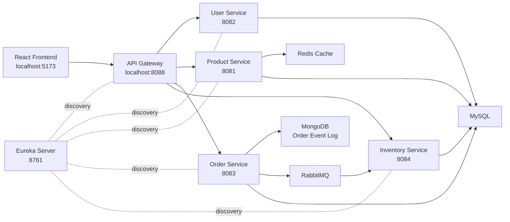

# E-Commerce Microservices với Spring Boot

Dự án E-Commerce theo kiến trúc Microservices, xây dựng bằng Spring Boot và React Vite cho đồ án môn Chuyên đề Lập trình Web 2.

Hệ thống có đầy đủ các thành phần chính: Frontend, API Gateway, Eureka Server, JWT Security, OpenFeign, RabbitMQ, Redis cache, MongoDB event log, MySQL và Docker Compose.

## Chức Năng Chính

- Đăng ký, đăng nhập và nhận JWT token.
- Phân quyền người dùng và admin bằng `role`.
- Xem danh sách sản phẩm, chi tiết sản phẩm, giỏ hàng và checkout.
- Tạo đơn hàng qua Order Service.
- Order Service gọi User Service và Product Service bằng OpenFeign.
- Order Service gửi message qua RabbitMQ để Inventory Service kiểm tra tồn kho.
- Inventory Service xác nhận hoặc từ chối đơn hàng.
- MongoDB lưu lịch sử sự kiện đơn hàng.
- Redis cache danh sách sản phẩm.
- Admin quản lý sản phẩm, tồn kho, đơn hàng, người dùng và tin tức.
- Docker Compose triển khai toàn bộ hệ thống.

## Công Nghệ

Backend:

- Java 21
- Spring Boot 3.3.5
- Spring Data JPA
- Spring Security
- JWT
- Spring Cloud Gateway
- Eureka Server
- OpenFeign
- RabbitMQ
- Redis
- MongoDB
- MySQL
- Docker Compose

Frontend:

- React Vite
- Axios
- React Router
- React Toastify
- Context API

## Kiến Trúc Tổng Quan



## Luồng Demo Chính

```text
Đăng ký
-> Đăng nhập nhận JWT
-> Xem sản phẩm
-> Thêm vào giỏ hàng
-> Checkout tạo đơn hàng
-> Order Service lưu đơn hàng vào MySQL
-> Order Service gửi message RabbitMQ
-> Inventory Service kiểm tra tồn kho
-> Inventory Service gửi kết quả về Order Service
-> Order Service cập nhật trạng thái đơn hàng
-> MongoDB lưu event log
-> Redis cache danh sách sản phẩm
```

## Cấu Trúc Thư Mục

```text
microservice/
├── api-gateway/
├── eureka-server/
├── user-service/
├── product-service/
├── order-service/
├── inventory-service/
├── frontend-web/
├── docs/
├── docker-compose.yml
├── LAB6_REDIS_MONGODB_GUIDE.md
├── pom.xml
└── README.md
```

## Các Port Chính

| Thành phần | URL |
|---|---|
| Frontend | http://localhost:5173 |
| API Gateway | http://localhost:8088 |
| Eureka Dashboard | http://localhost:8761 |
| Product Service | http://localhost:8081 |
| User Service | http://localhost:8082 |
| Order Service | http://localhost:8083 |
| Inventory Service | http://localhost:8084 |
| RabbitMQ Management | http://localhost:15672 |
| MongoDB | localhost:27017 |
| Redis | localhost:6379 |
| phpMyAdmin | http://localhost:8089 |

## Gateway Routes

```text
/api/auth/**       -> user-service
/api/users/**      -> user-service
/api/products/**   -> product-service
/api/categories/** -> product-service
/api/brands/**     -> product-service
/api/orders/**     -> order-service
/api/inventory/**  -> inventory-service
```

## Tài Khoản Demo

Admin:

```text
Email: admin@example.com
Password: 123456
Role: ADMIN
```

User thường có thể đăng ký trực tiếp từ giao diện.

## Chạy Dự Án

Backend và hạ tầng:

```powershell
docker compose up -d --build
```

Frontend:

```powershell
cd frontend-web
npm install
npm run dev
```

Kiểm tra container:

```powershell
docker compose ps
```

Xem log:

```powershell
docker compose logs --tail=100 api-gateway
docker compose logs --tail=100 product-service
docker compose logs --tail=100 order-service
docker compose logs --tail=100 inventory-service
```

## Tài Liệu Báo Cáo

Các tài liệu trong thư mục `docs/`:

- `docs/REQUIREMENTS_CHECKLIST.md`: đối chiếu yêu cầu môn học.
- `docs/DEMO_SCRIPT.md`: kịch bản demo từng bước.
- `docs/API_TEST_GUIDE.md`: danh sách API và lệnh test nhanh.
- `docs/REPORT_OUTLINE.md`: dàn ý báo cáo và slide.
- `docs/SCREENSHOT_CHECKLIST.md`: danh sách màn hình nên chụp để đưa vào báo cáo.

## Ghi Chú Demo

Nếu thêm sản phẩm trực tiếp bằng SQL, cần xóa Redis cache để Product Service đọc lại dữ liệu mới:

```powershell
docker exec redis-microservice redis-cli FLUSHALL
```

Nếu vừa khởi động Docker, nên chờ các container chuyển sang trạng thái `healthy` rồi mới demo frontend.
